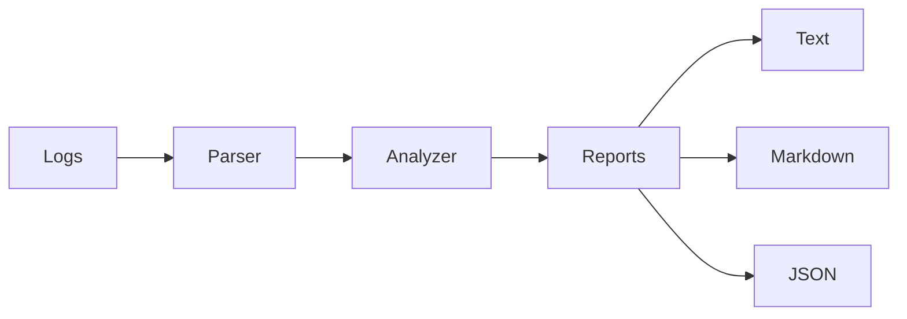

# LogSentry

**LogSentry** is a dependency-free **Lua 5.4 command-line log analysis tool** that turns structured application logs into operational metrics and anomaly alerts.

It was built as a software-engineering portfolio project to demonstrate that Lua can be used for more than small scripts or game logic. The project applies modular design, data parsing, analytics, CLI design, automated testing, CI, deterministic reporting, and defensive error handling.

## Why this project?

Production systems generate large amounts of logs, and developers often need a fast way to answer questions such as:

- How many requests are failing?
- Which endpoints receive the most traffic?
- Are requests becoming unusually slow?
- Is the current error rate above an acceptable threshold?
- Can the result be consumed by another tool?

LogSentry answers those questions from the command line without external Lua packages.

## Features

- Parses structured `key=value` application logs
- Counts log levels and HTTP status codes
- Calculates request error rate
- Calculates average and maximum latency
- Detects requests above a configurable latency threshold
- Detects high error rates
- Ranks the most frequently requested endpoints
- Records malformed/rejected input lines
- Produces text, Markdown, or JSON reports
- Supports report file output
- Uses meaningful process exit codes
- Includes a dependency-free automated test suite
- Runs tests automatically with GitHub Actions

## Tech

- **Lua 5.4**
- Lua standard library
- GitHub Actions
- Make

No runtime package installation is required.

## Architecture



The source is split by responsibility:

```text
src/logsentry/
├── analyzer.lua   # Metrics, thresholds, anomaly detection
├── cli.lua        # CLI options, validation, exit codes
├── json.lua       # Deterministic JSON serialization
├── parser.lua     # Structured log parsing
└── report.lua     # Text, Markdown, and JSON presentation
```

For the design rationale, see [docs/ARCHITECTURE.md](docs/ARCHITECTURE.md).

## Example input

```text
2026-09-19T02:00:08Z level=ERROR method=POST path=/api/orders status=500 latency_ms=1280 service=api
```

Each event begins with a timestamp followed by whitespace-separated `key=value` fields.

## Run it

Install Lua 5.4, clone the repository, and run:

```bash
git clone https://github.com/Arondith/Lua.git
cd Lua
lua main.lua analyze sample/app.log
```

Example output:

```text
LogSentry Analysis
===================
Parsed entries : 8
Rejected lines : 0
Error requests : 2 (25.00%)
Slow requests  : 2
Avg latency    : 447.75 ms
Max latency    : 1675.00 ms
```

## Output formats

### Text

```bash
lua main.lua analyze sample/app.log
```

### Markdown

```bash
lua main.lua analyze sample/app.log --format markdown
```

### JSON

```bash
lua main.lua analyze sample/app.log --format json
```

### Save a report

```bash
lua main.lua analyze sample/app.log --format markdown --output report.md
```

## Configure anomaly thresholds

Flag a request as slow when it takes at least 800 ms:

```bash
lua main.lua analyze sample/app.log --slow 800
```

Trigger the error-rate alert at 20%:

```bash
lua main.lua analyze sample/app.log --error-rate 0.20
```

Both options can be combined:

```bash
lua main.lua analyze sample/app.log --slow 800 --error-rate 0.20
```

## Run tests

```bash
lua tests/run.lua
```

Or, where Make is available:

```bash
make test
```

The tests cover parsing, validation, analytics, sorting, JSON output, and report generation.

## GitHub Actions

Every push and pull request to `main` runs:

1. Lua 5.4 installation
2. the complete test suite
3. a real analysis of the sample log

This prevents broken changes from being silently merged into the portfolio project.

## What this demonstrates to employers

This repository demonstrates practical experience with:

- Lua programming
- modular software architecture
- parsing and data transformation
- algorithms and aggregation
- defensive programming
- CLI application design
- configurable business rules
- test automation
- continuous integration
- technical documentation
- Git/GitHub workflows

## Possible next steps

- Stream logs instead of loading the whole file
- Add latency percentiles such as p50, p95, and p99
- Support Nginx and JSON Lines formats
- Add time-window analysis
- Add configuration files
- Add OpenTelemetry-compatible input
- Package the application through LuaRocks

## Author

**Charles Luke Templonuevo**

- GitHub: [Arondith](https://github.com/Arondith)
- Portfolio: [charles-luke-templonuevo.vercel.app](https://charles-luke-templonuevo.vercel.app/)
