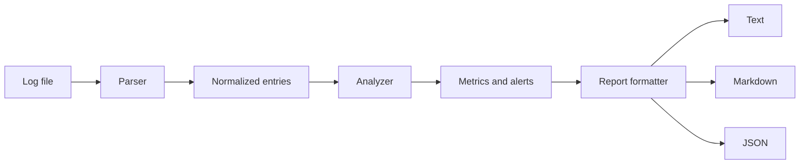

# LogSentry Architecture

LogSentry is intentionally dependency-free and split into small modules with clear responsibilities.

## Data flow



## Modules

### `parser.lua`

Converts newline-delimited application logs into normalized Lua tables.

A valid line starts with a timestamp and then uses whitespace-separated `key=value` fields:

```text
2026-09-19T02:00:08Z level=ERROR method=POST path=/api/orders status=500 latency_ms=1280
```

The parser also records malformed lines instead of silently discarding them.

### `analyzer.lua`

Contains the core domain logic. It calculates:

- total parsed events
- counts by log level
- HTTP status distribution
- endpoint frequency
- average and maximum latency
- slow-request count
- error rate
- threshold-based alerts

The analyzer receives thresholds as configuration, keeping policy separate from parsing and presentation.

### `report.lua`

Transforms the analyzer output into human-readable text, Markdown, or machine-readable JSON.

### `json.lua`

A small deterministic JSON encoder used to keep the project dependency-free. Object keys are sorted so generated output remains stable across runs.

### `cli.lua`

Owns command-line argument parsing, validation, file output, and exit codes. It coordinates the lower-level modules but does not contain analytics logic.

## Engineering choices

### Dependency-free core

The application uses only the Lua standard library. This makes it easy to run in lightweight environments such as automation scripts, CI jobs, containers, embedded tooling, or server administration tasks.

### Separation of concerns

Parsing, analysis, presentation, and command-line behavior are independent modules. Each can evolve without requiring a rewrite of the others.

### Deterministic analysis

The analyzer does not depend on global state. Given the same entries and thresholds, it produces the same result, making it straightforward to test.

### Graceful parsing

A malformed log line is recorded in `rejected` rather than terminating the entire analysis job. This is useful when processing real operational logs, where imperfect input is common.

## Future architecture

A larger version could add streaming analysis for very large files, pluggable parsers, percentile latency calculations, configuration files, and adapters for Nginx, JSON Lines, or OpenTelemetry exports.
